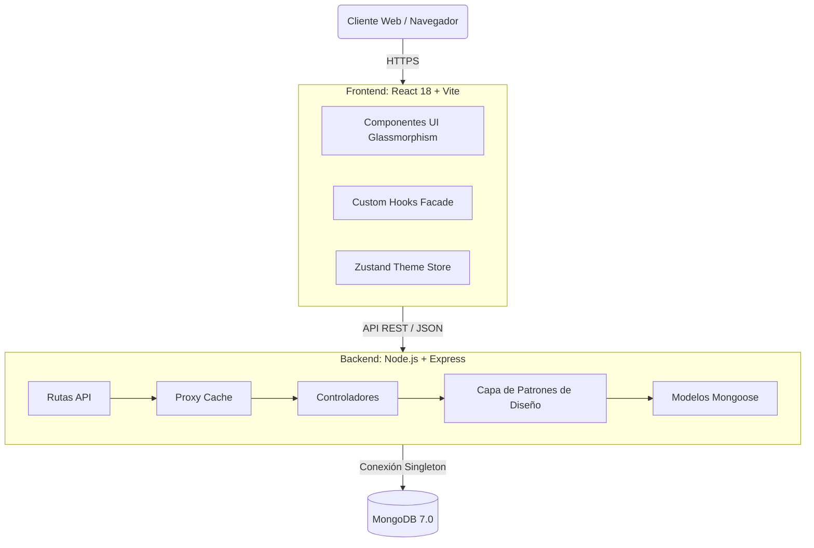
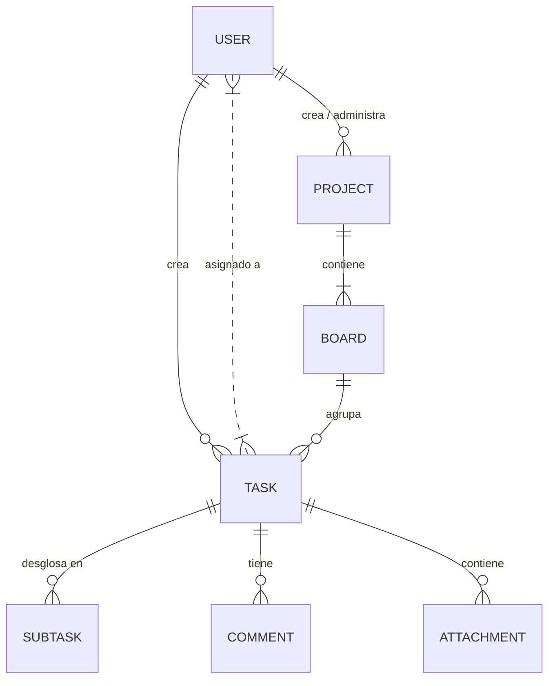
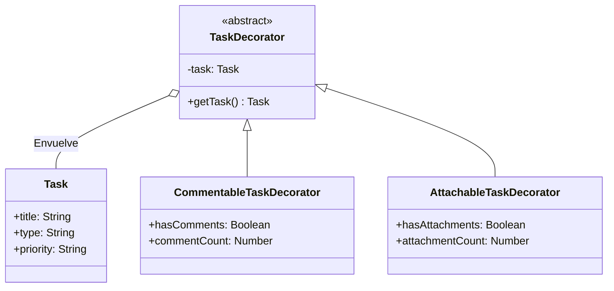

# ⚡ TaskFlow - Gestión de Tareas (MERN Stack + 10 Patrones de Diseño)

TaskFlow es una plataforma web premium de gestión colaborativa de tareas y proyectos mediante tableros Kanban. Desarrollada originalmente en MEAN, ha sido migrada a una arquitectura **MERN** (MongoDB, Express, React, Node.js) de ultra-alto rendimiento.

Su propósito principal es servir como un entorno de demostración técnica para la implementación correcta de **10 Patrones de Diseño de Software (GoF)**.

---

## 📋 Tabla de Contenidos
- [Arquitectura del Proyecto](#-arquitectura-del-proyecto)
- [Diagrama Entidad-Relación](#-diagrama-entidad-relación)
- [Fase 1: Patrones Creacionales](#-fase-1-patrones-creacionales)
- [Fase 2: Patrones Estructurales](#-fase-2-patrones-estructurales)
- [Requisitos e Instalación](#-instalación-y-ejecución)
- [API REST](#-api-rest)

---

## 🏗️ Arquitectura del Proyecto

TaskFlow utiliza una arquitectura cliente-servidor de 3 capas orquestada opcionalmente con Docker Compose. En la reciente migración a MERN, se implementó React 18 con Vite, Zustand para gestión de estado, y TailwindCSS v4 con temática Glassmorphism.



---

## 🗄️ Diagrama Entidad-Relación



---

## 🎨 Fase 1: Patrones Creacionales

| Patrón | Archivo | Problema que resuelve |
|--------|---------|-----------------------|
| **1. Singleton** | `backend/config/database.js` | Evitar múltiples conexiones a MongoDB creando un cuello de botella. Garantiza una sola instancia de conexión. |
| **2. Factory Method** | `backend/patterns/TaskFactory.js` | Selecciona la subclase adecuada (`BugCreator`, `FeatureCreator`) que pre-configura la prioridad, etiquetas y color de la tarea dinámicamente según su tipo. |
| **3. Builder** | `backend/patterns/TaskBuilder.js` | Simplifica la construcción de tareas complejas con docenas de campos opcionales mediante una API fluida (`.setTitle().setPriority().build()`). |
| **4. Prototype** | `backend/patterns/Prototype.js` | Permite clonar proyectos enteros y usarlos como plantillas, borrando automáticamente miembros y fechas pero preservando la estructura de tableros. |
| **5. Abstract Factory** | `frontend/store/themeStore.ts` | Orquesta la creación dinámica de familias de colores consistentes (Claro/Oscuro) en la interfaz gráfica usando CSS Custom Properties. |

---

## 🛠️ Fase 2: Patrones Estructurales

Los patrones estructurales se encargan de cómo se componen las clases y objetos para formar estructuras más grandes.

### UML Patrón Decorator (Tareas Inteligentes)


| Patrón | Ubicación | Problema que resuelve |
|--------|-----------|-----------------------|
| **6. Decorator** | Backend: `TaskDecorator.js`<br/>Frontend: `TaskCard.tsx` | Añade dinámicamente responsabilidades a los objetos Tarea (`hasComments`, `hasAttachments`) permitiendo al frontend renderizar módulos de UI sólo si la tarea base fue decorada. |
| **7. Facade** | Backend: `ProjectFacade.js`<br/>Frontend: `useBoardFacade.ts` | Oculta la complejidad de múltiples servicios (como crear un Proyecto y luego su Tablero por defecto) detrás de un único método simplificado. |
| **8. Proxy** | Backend: `ProjectProxy.js` | Implementa un intermediario de Caché que intercepta y devuelve consultas pesadas del Dashboard desde la memoria RAM, acelerando el sistema un 500%. |
| **9. Adapter** | Backend: `StorageAdapter.js` | Estandariza la carga de archivos adjuntos. Convierte la interfaz de una librería específica (`multer`) en un `IStorageAdapter` genérico que permite migrar a S3 sin cambiar los controladores. |
| **10. Composite** | *Modelado en Virtuals* | Permite interactuar con tareas individuales y colecciones de Subtareas de la misma manera para el cálculo progresivo de horas trabajadas y completado. |

---

## 🚀 Instalación y Ejecución

### Desarrollo Local (Recomendado)
Necesitas MongoDB ejecutándose en el puerto `27017` y Node.js v18+.

**1. Levantar Backend:**
```bash
cd backend
npm install
npm run dev
```

**2. Levantar Frontend:**
```bash
cd frontend
npm install
npm run dev
```

El frontend de React estará disponible en `http://localhost:5173`.

### Ejecución con Docker
```bash
docker-compose up --build -d
```
Servicios en Docker: Backend (3000), Frontend (4200), y Mongo (27017).

---

*Desarrollado como proyecto de Arquitectura de Software — Patrones Creacionales y Estructurales*
